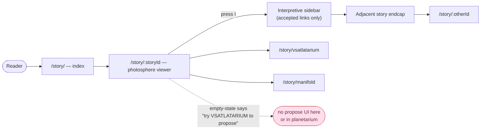
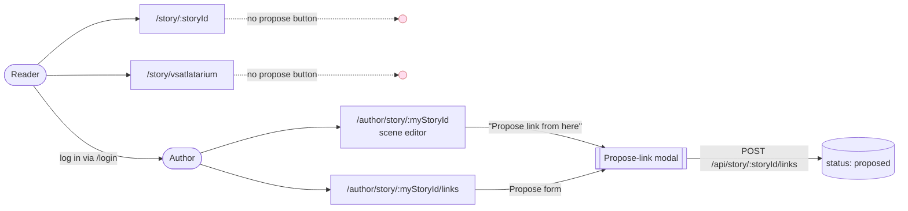
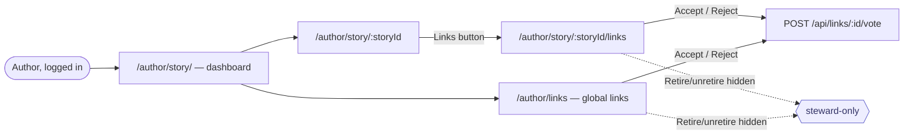
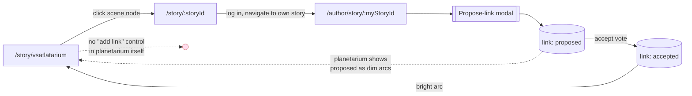

# VSAT Role × Page × Action Sitemap

Purpose: audit that every intended interaction is reachable for the role it is meant for, and that no action leaks to a role it should not have. Three roles in this system:

- **reader** — unauthenticated, or authenticated but not an author of the story in question
- **author** — logged in; can edit stories they authored
- **steward** — authenticated user whose email is listed in `STEWARD_EMAILS` (or who has flipped the `vsat_steward` dev cookie when `DEV_STEWARD_TOGGLE=1`)

"Author" is not a separate account type — any logged-in user has author powers on stories they own. Ownership is checked per-story by `assertAuthorMiddleware` on `/author/story/:storyId/...` (except the `/links` sub-route, which is open to any logged-in user so anyone can vote on links that touch a story). Stewards bypass the ownership check.

## Access gates at a glance

| Gate | Enforced by | Applies to |
| --- | --- | --- |
| Login required | `authenticationRequired` middleware (config `authentication.pathsRequiringAuthentication`) | `/author/*`, `/api/*` |
| Story ownership | `assertAuthorMiddleware` (Astro) | `/author/story/:storyId/...` except `.../links` |
| Steward role | `isStewardUser(user, cookie)` | retire/unretire link actions; steward console |

Unauthenticated hits to guarded paths redirect to `/login`. A logged-in non-owner reaching `/author/story/:storyId` is redirected back to `/author/story` with an `Unauthorized` error code.

## Public pages

### `/` — landing
- reader / author / steward: view, navigate to login or `/author/story`.

### `/login`, `/login/callback`
- reader: magic-link login; callback completes auth and redirects to `/author/story`.
- already-logged-in users just pass through.

### `/stewardship` — stewardship compact
- all roles: read-only. Public statement of principles, roles, and procedures.

### `/story/` — story index
- all roles: browse published stories, link to VSATLATARIUM.

### `/story/:storyId` — read a story
- all roles: same view. A-Frame scene viewer; "Interpretive" sidebar (press `I`) showing **accepted** links only; endcap cards to adjacent stories. No role branching in the page itself.
- Note: the empty-state text says "Try VSATLATARIUM to propose one," but the propose UI is **not** exposed here or in VSATLATARIUM — only from inside the author scene editor and the per-story links page. See "Gaps" below.

### `/story/manifold` — adjacency grid / link list
- all roles: view all links and their statuses (proposed / accepted / rejected / retired), filter by pilot, click through to stories.

### `/story/vsatlatarium` — 3D planetarium
- all roles: navigate scene and story nodes for published stories, switch planetarium ↔ geomview, hover / click into story detail. No role-gated controls.

## Authenticated pages (`/author/*`)

### `/author/story/` — author dashboard
- author: list own published + unpublished stories, rename self, create new story, log out.
- steward: same, plus a banner linking to the steward console and (if `DEV_STEWARD_TOGGLE=1`) a toggle for steward mode.

### `/author/story/:storyId` — story editor
- author (owner only): edit title, CRUD scenes, edit scene content, upload images + audio, publish / unpublish, delete story, **propose link from a scene** (opens propose-link modal), navigate to preview or links.
- steward (non-owner): bypasses ownership check, so has the same editing powers on any story. This is by design for stewardship, but worth flagging.
- author (non-owner): redirected away with `Unauthorized`.

### `/author/story/:storyId/preview` — preview as reader
- author (owner) and steward: read-only preview of the published shape of the story.
- author (non-owner): redirected away.

### `/author/story/:storyId/links` — links involving this story
- any logged-in user (ownership **not** required on this sub-route): view inbound + outbound links; propose a new link; accept / reject (vote).
- steward: additionally retire / unretire. UI exposes the retire/unretire buttons only when `isStewardUser` is true; help text on the page says "Retire/unretire actions are visible to stewards only."

### `/author/links` — global link dashboard
- any logged-in user: review all links site-wide, accept / reject.
- steward: additionally retire / unretire.
- Known scope issue: currently shows all links, not scoped to the current author's stories (see `docs/qa-checklist.md` P1).

### `/author/steward` — steward console
- non-steward logged-in user: page loads with a message "You are not marked as a steward for this environment." No adjudication UI.
- steward: text-first table of all links; retire / unretire inline.

### `/author/pilot/`, `/author/pilot/:pilotId` — pilots
- any logged-in user: create pilot, assign stories to pilot, add interpretive notes, fetch JSON report.
- No steward-specific controls here.

## API surface (all under `/api/*`, login required unless noted)

| Endpoint | Who | Notes |
| --- | --- | --- |
| `POST /api/story/:storyId/links` | any logged-in user | propose a link (status `proposed`). |
| `POST /api/links/:linkId/vote` | any logged-in user | `{vote: "accept"\|"reject"}`. |
| `POST /api/links/:linkId/retire` | **steward only** | 403 for non-stewards; toggles to/from `retired`. |
| `POST /api/pilot` | any logged-in user | create pilot. |
| `POST /api/pilot/:pilotId/stories` | any logged-in user | attach story to pilot. |
| `POST /api/pilot/:pilotId/notes` | any logged-in user | add interpretive note. |
| `GET  /api/pilot/:pilotId/report` | open | JSON report; no auth check on the route itself. |

Every API action has a UI entry point somewhere in `/author/*`.

## Role × action summary

| Action | reader | author (of story) | author (not of story) | steward |
| --- | --- | --- | --- | --- |
| Browse published stories | ✓ | ✓ | ✓ | ✓ |
| Read a story with accepted links | ✓ | ✓ | ✓ | ✓ |
| Use VSATLATARIUM / manifold | ✓ | ✓ | ✓ | ✓ |
| Read stewardship compact | ✓ | ✓ | ✓ | ✓ |
| Log in | ✓ | — | — | — |
| Create / edit / delete own story, scenes, media | — | ✓ | — | ✓ (any story) |
| Publish / unpublish own story | — | ✓ | — | ✓ (any story) |
| Propose a link | — | ✓ | ✓ | ✓ |
| Accept / reject a link (vote) | — | ✓ | ✓ | ✓ |
| Retire / unretire a link | — | — | — | ✓ |
| Create / manage pilots, notes | — | ✓ | ✓ | ✓ |
| Use steward console | — | — | — | ✓ |

## User journeys (Mermaid)

Each diagram is one question answered end-to-end. Dotted arrows are "you wish this existed" — i.e. reachability gaps.

### J1. Reader on a photosphere page: what can I do?



Reader interactions on a photosphere page = read the scene, read accepted interpretive links, jump to adjacent stories, jump to the global views. No write actions.

### J2. Reader → Propose a link (the "how do I contribute?" path)



Gap: a reader must (a) log in, and (b) have at least one of their own stories to get into a scene editor, because the only propose-link entry points are author-context. The public read page and planetarium invite proposals but do not host the UI.

### J3. Author reviews / votes on links touching their story



Note: `/author/story/:storyId/links` is **not** ownership-gated — any logged-in user can open it for any story and vote. Global `/author/links` is likewise open to any logged-in user (see qa-checklist P1).

### J4. Steward adjudicates links

```mermaid
flowchart LR
  S([Steward, logged in]) --> AD["/author/story/ — dashboard"]
  AD -->|steward banner| SC["/author/steward — console"]
  SC -->|Retire / unretire| RT["POST /api/links/:id/retire"]
  S --> ASL["/author/story/:storyId/links"]
  ASL -->|Retire / unretire<br/>(visible because isStewardUser)| RT
  S --> AL["/author/links"]
  AL -->|Retire / unretire| RT
  S --> AE["/author/story/:anyStoryId"]:::wide
  AE -->|bypasses ownership check| EDIT[[can also edit / delete<br/>ANY story]]:::gap

  classDef gap fill:#fde,stroke:#c66,color:#633;
  classDef wide fill:#ffd,stroke:#c90,color:#630;
```

Three surfaces for retire/unretire (console, per-story links, global links). Side-effect worth reviewing: `assertAuthorMiddleware` lets stewards through, so the steward role currently includes full content-edit power on any story, not just link adjudication.

### J5. How do I add a new steward?


There is no self-service promotion flow. Adding a steward in production = editing `STEWARD_EMAILS` and redeploying. The dev toggle exists only for testing and requires the env flag to be set.

### J6. Planetarium → add a link that shows up in the planetarium?



Round-trip works but is indirect: planetarium → story page → log in → own story editor → propose → (optionally vote to accept) → arcs update next planetarium load. There is no in-planetarium "add link between these two nodes I just clicked" affordance.

### J7. Full role × surface map (reference)

```mermaid
flowchart TB
  classDef pub fill:#efe,stroke:#6a6,color:#252;
  classDef auth fill:#eef,stroke:#66c,color:#225;
  classDef stewardOnly fill:#fef,stroke:#96c,color:#525;
  classDef api fill:#ffd,stroke:#c90,color:#630;

  R([reader]):::pub
  A([author]):::auth
  S([steward]):::stewardOnly

  subgraph Public
    H["/"]:::pub
    L["/login"]:::pub
    STW["/stewardship"]:::pub
    SI["/story/"]:::pub
    SR["/story/:storyId"]:::pub
    MF["/story/manifold"]:::pub
    VL["/story/vsatlatarium"]:::pub
  end

  subgraph Authed["/author/* (login required)"]
    AD["/author/story/"]:::auth
    AE["/author/story/:id<br/>(owner or steward)"]:::auth
    PRE["/author/story/:id/preview<br/>(owner or steward)"]:::auth
    ASL["/author/story/:id/links<br/>(any logged-in)"]:::auth
    AL["/author/links<br/>(any logged-in)"]:::auth
    PI["/author/pilot/*"]:::auth
    SCON["/author/steward"]:::stewardOnly
  end

  subgraph API["/api/*"]
    P1["POST /api/story/:id/links (propose)"]:::api
    P2["POST /api/links/:id/vote (accept/reject)"]:::api
    P3["POST /api/links/:id/retire (steward)"]:::api
    P4["pilot endpoints"]:::api
  end

  R --> H & L & STW & SI & SR & MF & VL
  A --> H & L & STW & SI & SR & MF & VL
  A --> AD & AE & PRE & ASL & AL & PI
  S --> AD & AE & PRE & ASL & AL & PI & SCON
  AE --> P1
  ASL --> P1 & P2
  AL --> P2
  SCON --> P3
  ASL --> P3
  AL --> P3
  PI --> P4
```



## Reachability gaps and questions worth auditing

- **Reader → Propose link**: page copy on `/story/:storyId` invites readers to "propose one" via VSATLATARIUM, but propose UI is only reachable through `/author/story/:storyId` (scene editor) and `/author/story/:storyId/links`. A reader who follows the prompt lands nowhere. Either drop the copy, surface a propose modal on the public read page (login-gated at submit), or add propose UI to VSATLATARIUM.
- **Steward global edit power**: stewards bypass `assertAuthorMiddleware`, so they can edit/publish/delete any story, not just adjudicate links. Intentional? The stewardship compact frames stewards as link adjudicators, not content editors.
- **`/author/links` scope**: shows all links site-wide to every logged-in user — effectively makes every logged-in user a global link reviewer. Known issue (qa-checklist P1); decide whether it should be author-scoped, steward-only, or renamed.
- **`/author/story/:storyId/links` has no ownership gate**: any logged-in user can vote on links for any story. Probably correct (voting is a community action), but worth confirming versus "only authors of either endpoint story can vote."
- **Pilot report `GET /api/pilot/:pilotId/report`** is unauthenticated. Intentional (public share link)? If yes, document it; if no, add the login gate.
- **No non-steward path to see retired links** on the public read page — retired links are hidden from readers. If stewardship is meant to be transparent, consider showing "retired" with the rationale visible.
